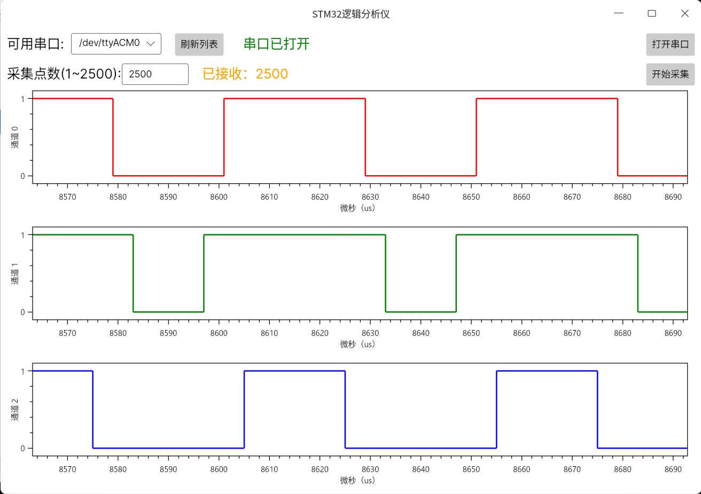

# logic-analyzer-upper-computer
STM32简易逻辑分析仪的配套上位机，采用Avalonia和OxyPlot的方案绘制波形图，界面如下图所示

## 📦 下位机硬件项目

本上位机配套的 STM32 硬件项目（基于 STM32F103C8T6）请见：
👉 [lxcy-tiger/STM32F103C8T6-LogicAnalyzer](https://github.com/lxcy-tiger/STM32F103C8T6-LogicAnalyzer)